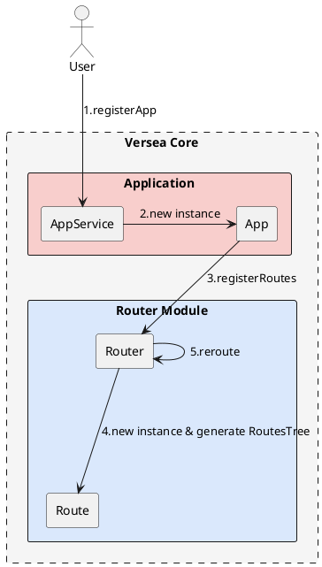
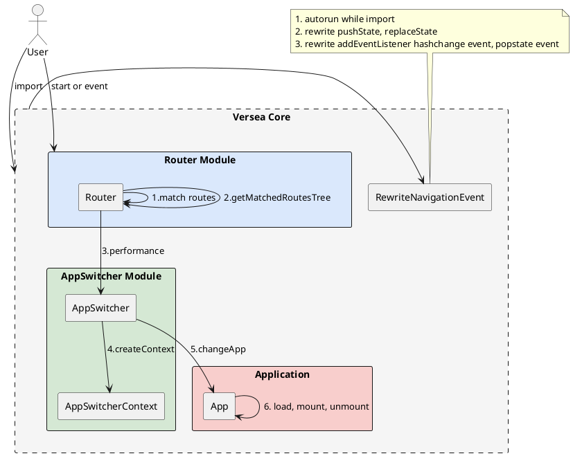

# versea 架构

## versea流程

### 注册 App 流程



1. 用户注册 app（通过 AppService 实例的 registerApp 方法）
1. 生成 app 实例
1. 根据注册 app 时传入的 routes 生成路由实例并存入 RoutesTree，后续会用这个 RoutesTree 做路由匹配。以下为路由树的简单示例
    ```js
    [
      {
        path: '/path1',
        apps: [app1]
      },
      {
        path: '/path2',
        apps: [app2]
      },
    ]
    ```

### reroute流程



当用户调用start 或 触发浏览器事件（路由切换或前进后退）会进入reroute流程

1. 根据当前访问页面路由匹配路由树，以下为匹配到的路由树的简单示例
    ```js
    // 假设浏览器当前访问路径为 '/path1'
    [
      {
        path: '/path1',
        apps: [app1]
      }
    ]
    ```
1. 加载匹配到的app（加载源代码）
1. 卸载旧的app
1. 挂载新的app


reroute 流程较为复杂，是整个 versea/core 的核心，控制整个应用加载，卸载流程，这里重点介绍一下 AppSwitcherContext，它需要记录 App 的加载顺序，mount 顺序和卸载顺序。当 changeApp 触发时，会生成一个新的 AppSwitcherContext。然后销毁当前的 AppSwitcherContext，使用新的 AppSwitcherContext 替代它。

